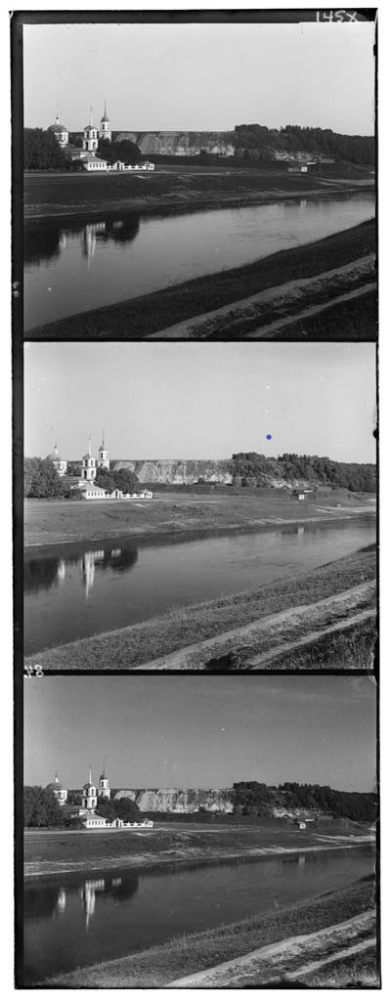
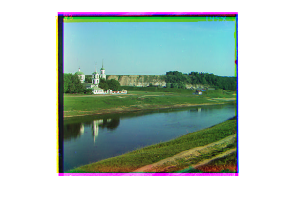

# RGB Image Reconstruction from Prokudin-Gorskii Glass Plate Photos (1911)

This project was done as part of my **Computer Vision course**, where the task was to reconstruct a full RGB color image from a black-and-white glass plate photo taken in **1911** by **Sergei Mikhailovich Prokudin-Gorskii**.

Gorskii used a special camera that captured **three separate grayscale images** in quick succession using different color filters — **Blue**, **Green**, and **Red**. The goal is to stack and align these to reconstruct a single, sharp color image.

## 🧠 What I Did

- Loaded the historical glass plate image (which contains all 3 channels stacked vertically).
- Split the image into **Blue**, **Green**, and **Red** components.
- Used the **Green channel** as the reference.
- Aligned the **Red and Blue** channels using **SSD (Sum of Squared Differences)**.
- Used `circshift()` in MATLAB to apply alignment.
- Combined all three into a single **RGB image**.

## 💻 Tools Used

- MATLAB
- Basic image processing operations (SSD, channel splitting, shifting)

##  Image Before Alignment


## 🔍 How It Works

1. The glass plate image is read and divided into three parts.
2. The center 51x51 region of the Green channel is used as a reference.
3. For both Red and Blue:
   - A brute-force search over [-10, 10] pixel shifts is done.
   - The shift with the minimum SSD value is selected.
4. The aligned channels are stacked using `cat(3, R, G, B)` to produce the final image.

## 🖼️ Result

After alignment, the final image is sharp and color-corrected. Without alignment, it appears blurry and ghosted due to channel misplacement.




## 📜 Historical Context

Sergei Mikhailovich Prokudin-Gorskii was one of the first to experiment with color photography. His work is preserved by the Library of Congress and represents a rare glimpse into pre-revolutionary Russia — in color.

## ⚙️ To Run

1. Open MATLAB.
2. Place `test_cv_img.jpeg` and the script in the same folder.
3. Run the script:
   ```matlab
   run('Aligning_RGB_Images.m');


